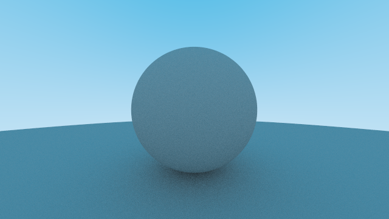

# Rust Ray Tracing Renderer

This project is a ray tracing renderer written in Rust, designed to generate high-quality images. Ray tracing is an image generation technique that creates realistic visual effects by simulating the interaction of light with objects.

Please following  [The Ray Tracing Road to Rust 🦀](https://the-ray-tracing-road-to-rust.vercel.app)